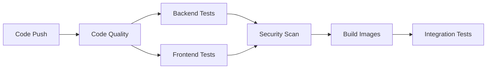
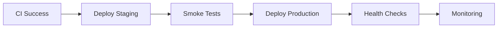

# 🚀 DevOps-Ready Full-Stack Application

## 📋 Project Overview

Bu proje, modern DevOps best practices kullanılarak geliştirilmiş full-stack bir uygulamadır.

### 🏗️ Architecture

```
┌─── 🌐 Frontend (Next.js 15) ────────────────┐
│  ├── React 19                              │
│  ├── TypeScript                            │
│  ├── Modern UI/UX                          │
│  └── Port: 5202                            │
└─────────────────────────────────────────────┘
                      │
                  HTTP API
                      │
┌─── 🔗 Backend (.NET Core 8) ───────────────┐
│  ├── Entity Framework Core                 │
│  ├── SQL Server                            │
│  ├── Health Checks                         │
│  └── Port: 5102                            │
└─────────────────────────────────────────────┘
                      │
                   Database
                      │
┌─── 🗄️ Database (SQL Server) ────────────────┐
│  ├── User Management                       │
│  ├── Authentication                        │
│  └── Port: 1433                            │
└─────────────────────────────────────────────┘
```

## 🛠️ Technology Stack

### Frontend
- **Framework:** Next.js 15
- **Runtime:** React 19
- **Language:** TypeScript
- **Styling:** CSS Modules
- **Container:** Docker (Alpine Linux)

### Backend
- **Framework:** .NET Core 8
- **ORM:** Entity Framework Core
- **Database:** SQL Server 2022
- **Container:** Docker (Microsoft Runtime)

### DevOps
- **CI/CD:** GitHub Actions
- **Containers:** Docker & Docker Compose
- **IaC:** Terraform (Optional)
- **Security:** Trivy, CodeQL
- **Monitoring:** Health Checks

## 🚀 Quick Start

### Prerequisites
- Docker Desktop
- .NET 8 SDK (for local development)
- Node.js 18+ (for local development)

### 🐳 Running with Docker (Recommended)

```bash
# Clone repository
git clone <repository-url>
cd <project-directory>

# Start all services
docker-compose up -d

# View logs
docker-compose logs -f

# Stop services
docker-compose down
```

### 🔧 Local Development

#### Backend (API)
```bash
cd src/api
dotnet restore
dotnet run --urls="http://localhost:5102"
```

#### Frontend (Web)
```bash
cd src/web
npm install
npm run dev
```

## 📱 Application URLs

| Service | URL | Description |
|---------|-----|-------------|
| 🌐 Web App | http://localhost:5202 | Next.js Frontend |
| 🔗 API | http://localhost:5102 | .NET Core API |
| 🏥 Health | http://localhost:5102/health | API Health Check |
| 📚 Swagger | http://localhost:5102/swagger | API Documentation |

## 🔐 Default Credentials

```
Username: admin
Password: 123456
```

## 🔄 CI/CD Pipeline

### Continuous Integration (CI)


### Continuous Deployment (CD)


## 🗂️ Project Structure

```
├── 📁 src/
│   ├── 📁 api/              # .NET Core Backend
│   │   ├── Controllers/     # API Controllers
│   │   ├── Data/           # Entity Framework Context
│   │   ├── Models/         # Data Models
│   │   └── Program.cs      # Application Entry Point
│   └── 📁 web/             # Next.js Frontend
│       ├── app/            # App Router Pages
│       ├── components/     # React Components
│       └── styles/         # CSS Styles
├── 📁 docker/              # Container Definitions
│   ├── api.Dockerfile      # Backend Container
│   └── web.Dockerfile      # Frontend Container
├── 📁 .github/workflows/   # CI/CD Pipelines
│   ├── ci.yml             # Continuous Integration
│   └── cd.yml             # Continuous Deployment
├── 📁 infrastructure/      # Infrastructure as Code
├── 📁 scripts/            # Deployment Scripts
└── docker-compose.yml     # Multi-Service Orchestration
```

## 🧪 Testing

### Run All Tests
```bash
# Backend Tests
cd src/api
dotnet test

# Frontend Tests  
cd src/web
npm test
```

### Integration Tests
```bash
# Start services
docker-compose up -d

# Run integration tests
npm run test:integration
```

## 📊 Monitoring & Health

### Health Checks
- **API Health:** `GET /health`
- **Database Health:** Included in API health
- **Container Health:** Docker healthcheck

### Metrics
- Response times
- Error rates
- Resource usage
- Business metrics

## 🔒 Security

### Implemented Security Measures
- ✅ **Input Validation**
- ✅ **SQL Injection Prevention** (EF Core)
- ✅ **XSS Prevention** (React)
- ✅ **CORS Configuration**
- ✅ **Container Security** (Non-root user)
- ✅ **Dependency Scanning** (Trivy)
- ✅ **Secret Management**

## 🚀 Deployment

### Environments

| Environment | URL | Purpose |
|-------------|-----|---------|
| 🧪 **Development** | http://localhost | Local development |
| 🎭 **Staging** | https://staging.yourapp.com | Pre-production testing |
| 🏭 **Production** | https://yourapp.com | Live application |

### Deployment Options

1. **Docker Compose** (Local/Dev)
2. **Kubernetes** (Scalable)
3. **IIS** (Windows Server)
4. **Azure Container Apps**
5. **AWS ECS**

## 📚 Documentation

- [API Documentation](docs/api.md)
- [Deployment Guide](docs/deployment.md)
- [Contributing](docs/contributing.md)
- [Troubleshooting](docs/troubleshooting.md)

## 🤝 Contributing

1. Fork the repository
2. Create feature branch (`git checkout -b feature/amazing-feature`)
3. Commit changes (`git commit -m 'Add amazing feature'`)
4. Push to branch (`git push origin feature/amazing-feature`)
5. Open Pull Request

---

**🎯 Built with DevOps Excellence in Mind**

This application demonstrates modern software development practices including containerization, CI/CD pipelines, infrastructure as code, and comprehensive monitoring. 